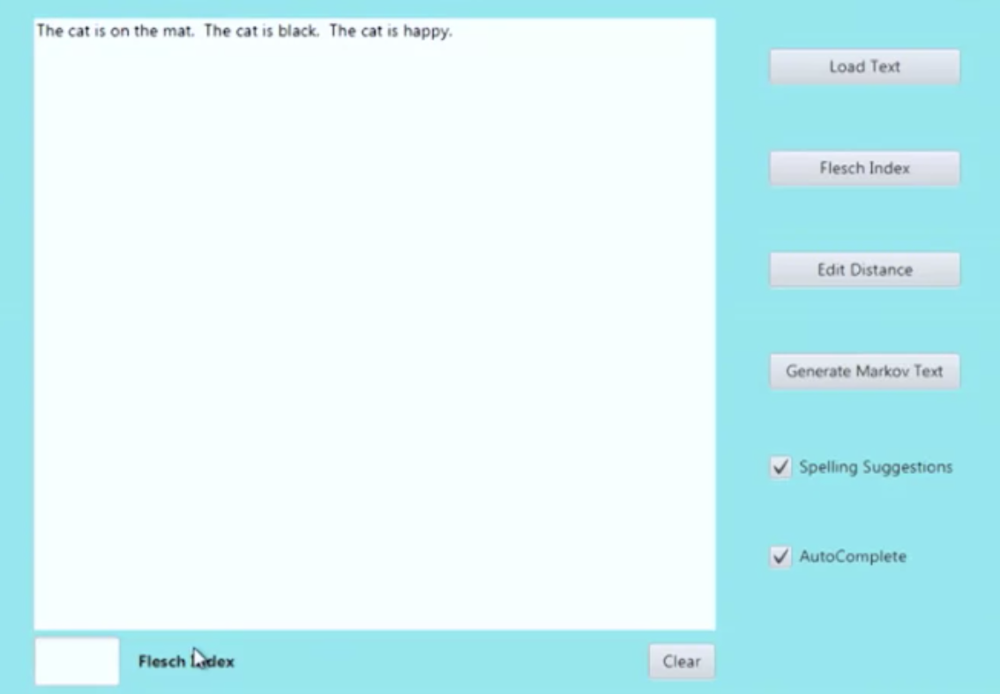

# TextEditor

TextEditor is a text editor project aimed to include a variety of text processing features such as autocorrect, Markov text generation, word paths, and more. TextEditor is implemented with data structures such as word trees, linked lists and more. This allows for fast editing capabilities and state tracking of recent files opened

With the help of a variety of popular data structures and related libraries, TextEditor aims to make text processing easier than ever. It supports the most common text markdown, programming language, and file format syntaxes.

TextEditor has been optimized for best runtime performance using algorithm analysis techniques such as time and space complexity, with measure timing.
